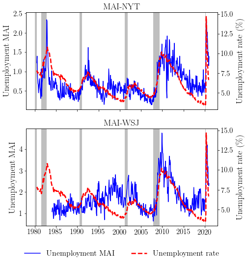

# Data for Macroeconomic Attention and Risk Premia

We provide the daily and monthly monthly macroeconomic attention indices for the New York Times and Wall Street Journal used in Fisher, Martineau, and Sheng (2021) "Macroeconomic Attention and Risk Premia".

Columns ending with "_ni" and "_wi" corresponds to NYT and WSJ, respectively, and those without corresponds to the composite index. 

The data is available from June 1980 to December 2020. We plan to update the data annually. 

We also include the 3-day average (MAI3) and the 3-day detrended MAI-Pre (dMAI3) prior to Unemployment and FOMC announcements in MAI_Unemployment_Announcement.csv and MAI_FOMC_Announcement.csv. Note that computing the 3-day detrended MAI-Pre is not trivial due to the dynamic window length between announcements. The results reported in the paper are robust to simply taking the 3-day average prior to announcements. 

If you use this data, please cite our study accordingly. 

